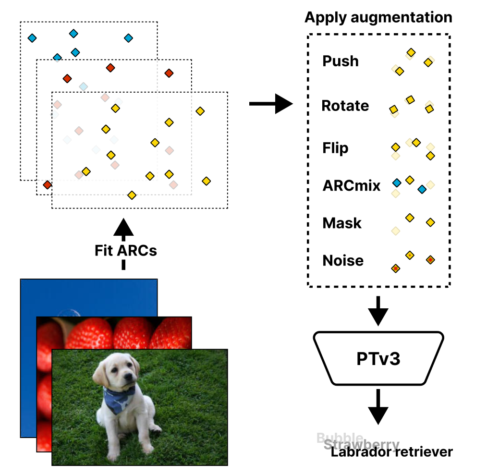

<div align="center">
<h1>ARC: Anchored Representation Clouds for High-Resolution INR Classification</h1>

<a href="https://arxiv.org/abs/TODO"></a>
<a href="https://iclr.cc/Conferences/2025"></a>

**[Delft University of Technology, Computer Vision Lab](https://www.tudelft.nl/en/ewi/over-de-faculteit/afdelingen/intelligent-systems/pattern-recognition-bioinformatics/computer-vision-lab)**

Joost Luijmes, Alexander Gielisse, Roman Knyazhitskiy, Jan van Gemert

</div>

```bibtex
@inproceedings{luijmes2025arc,
    title={{ARC}: Anchored Representation Clouds for High-Resolution {INR} Classification},
    author={Joost Luijmes and Alexander Gielisse and Roman Knyazhitskiy and Jan van Gemert},
    booktitle={Workshop on Neural Network Weights as a New Data Modality},
    year={2025},
    url={https://openreview.net/forum?id=CoUC4xDWvW}
}
```

<div align="center">
    
</div>


## Overview
Official implementation of the paper ***ARC: Anchored Representation Clouds for High-Resolution INR Classification*** (ICLR 2025 Workshop Weight Space Learning).

By far, the most ergonomic way of using this code is shown in the `notebooks` folder.

*For reference*, we additionally include some original code in the `tasks` and `configs` folders. This code can serve as a baseline for new implementations of (downstream) ARC usage but is outdated and may not work correctly.


## Install
First, clone the repository to your machine. Make sure you have [`uv`](https://docs.astral.sh/uv) (version >= 0.5.3) installed. This code was used and tested on both Linux and Windows with CUDA 11.8.

```bash
git clone https://github.com/JLuij/anchored_representation_clouds
uv sync
```

To use Point Transformer V3 training scripts, some additional packages are required. We refer to [their installation instructions](https://github.com/Pointcept/PointTransformerV3).


## Acknowledgements
We are grateful for the following repos whose code we have used in our research and of which parts are included in this repo
- [Point Transformer V3](https://github.com/Pointcept/PointTransformerV3)
- [DWSNets](https://github.com/AvivNavon/DWSNets)


## License
This project is licensed under the GNU GPLv3 License - see the [LICENSE](LICENSE) file for details.
